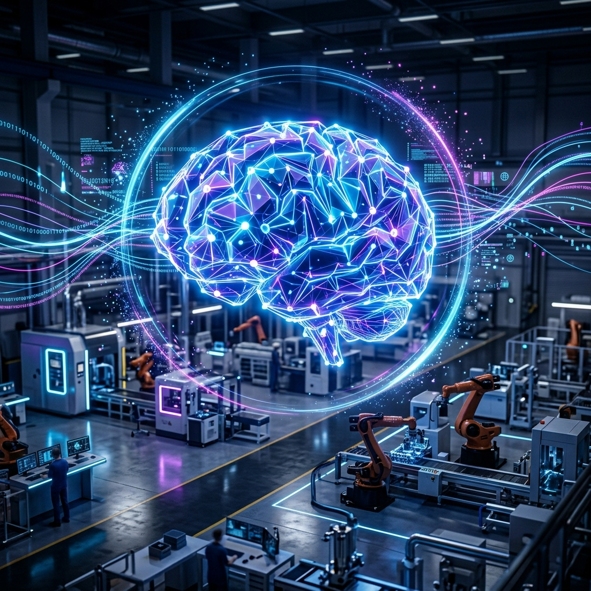

# 🏭 IKP: Industrial Knowledge Intelligence Platform

> **AI-powered Unified Operations Brain for Asset-Intensive Industries**  
> *ET AI Hackathon 2026 — Theme: Industrial Intelligence / Knowledge Engineering*



## 🎯 The Challenge (The "Knowledge Cliff")

In heavy industry, fragmentation is not just a file management problem—it is a safety, quality, and operational efficiency crisis. Indian manufacturing and energy companies operate across 7 to 12 disconnected document systems. P&IDs, maintenance work orders, SOPs, and inspection records are heavily siloed, contributing to **18–22% of unplanned downtime**. 

Furthermore, as 25% of experienced industrial engineers face retirement in the next decade, their undocumented operational knowledge risks being lost forever.

## 💡 Our Solution: The Unified Asset Brain

**IKP** is an AI-powered Industrial Knowledge Intelligence platform that acts as a single, omniscient brain for your factory. It ingests heterogeneous documents (SOPs, maintenance records, safety procedures) and makes their collective intelligence queryable, actionable, and continuously updated.

### 🏆 How We Address the Judging Criteria

| Hackathon Requirement | Our Implementation |
|-----------------------|--------------------|
| **Universal Document Ingestion & Knowledge Graph** | Automated pipeline that parses industrial PDFs/CSVs and builds a **Neo4j Knowledge Graph**, automatically mapping the relationships between Machines, Documents, Failures, and Engineers. |
| **Expert Knowledge Copilot** | An interactive **Generative AI RAG Assistant** that answers operational queries with strict **source citations, confidence scores, and risk level assessments**. |
| **Maintenance Intelligence & RCA** | An integrated dashboard monitoring real-time plant health, asset failures, and providing predictive insights to reduce unplanned downtime. |
| **Quality & Regulatory Compliance** | Dedicated compliance tracking to map regulatory requirements against active equipment states. |

## ✨ Enterprise-Grade Features

- 🔐 **Role-Based SSO:** Distinct views for Plant Managers, Maintenance Engineers, and Admins.
- 📄 **Multi-modal Ingestion:** Drop in PDFs, TXT files, and CSV logs to instantly vectorize them into ChromaDB.
- 🤖 **Reasoning LLM Core:** Powered by the cutting-edge `Llama-3.3-70B` via Groq for instantaneous, highly-accurate engineering reasoning.
- 🔗 **Relationship Visualization:** Interactive 2D Knowledge Graph canvas to trace asset topology.

---

## 🏗️ Architecture

```mermaid
graph TB
    subgraph Frontend["Frontend (React + Vite)"]
        UI[Material UI & Tailwind]
        Graph[Knowledge Graph Viz]
    end

    subgraph Backend["Backend (FastAPI)"]
        API[REST API]
        Auth[JWT Auth]
        Agents[AI Agents]
    end

    subgraph AI["AI Pipeline"]
        RAG[RAG Engine]
        EMB[BAAI/bge-small-en-v1.5]
        LLM[Llama 3.3 70B (Groq)]
    end

    subgraph Storage["Data Layer"]
        SQLite[(SQLite)]
        ChromaDB[(ChromaDB)]
        Neo4j[(Neo4j Graph)]
    end

    Frontend -->|REST HTTP| Backend
    Backend --> Agents
    Agents --> RAG
    RAG --> EMB & LLM
    Agents --> SQLite & Neo4j
    EMB --> ChromaDB
```

---

## 🚀 Quick Start Guide for Judges

We have containerized the entire platform so it can be evaluated instantly without complex local setups.

### Prerequisites
- Docker Desktop
- An active `GROQ_API_KEY` (Free tier works perfectly)

### 1. Clone & Configure
```bash
git clone <your-repository-url>
cd ET-2.0
cp .env.example .env
```
*Open the `.env` file and insert your `GROQ_API_KEY`.*

### 2. Launch the Platform
```bash
docker compose up -d --build
```
*This command will build the frontend, backend, and spin up the Neo4j database simultaneously.*

### 3. Access the Application
The platform is now live on your local machine:
- **Frontend Dashboard:** [http://localhost:3000](http://localhost:3000)
- **Backend Swagger API Docs:** [http://localhost:8000/docs](http://localhost:8000/docs)
- **Neo4j Graph Browser:** [http://localhost:7474](http://localhost:7474)

**Demo Login Credentials:**
- **Email:** `admin@ikp.com`
- **Password:** `admin123`

---

## 🔮 Future Scope
- **IoT Sensor Fusion:** Feed live SCADA/PLC telemetry data into the RAG context for real-time diagnostics.
- **Vision Models:** Use multi-modal LLMs to parse complex P&ID engineering schematics directly.
- **Mobile First Edge:** Offline-capable progressive web app (PWA) for field technicians in low-bandwidth factory zones.

## 👥 Contributors
- **Team Antigravity** | ET AI Hackathon 2026

## 📄 License
MIT License — See [LICENSE](LICENSE) for details.
